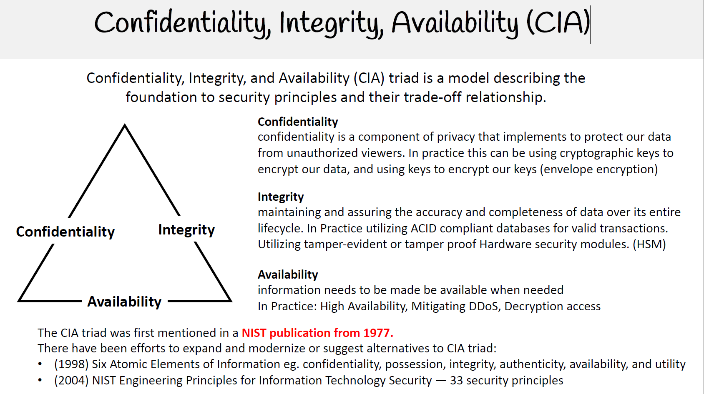

# The CIA triad

# Preservation of:

### Confidentiality
• Protecting information from unauthorized parties.

### Integrity
• Protecting information from modification by unauthorized users.

### Availability
• Making the information available to authorized users of the information asset.

#### ACID Compliance in a Database

ACID compliance refers to the presence of four essential properties in a database transaction to ensure its reliability and integrity.
The four properties are atomicity, consistency, isolation, and durability.
ACID-compliant databases are designed to ensure reliable and secure data transactions.
The 4 ACID Properties:

1. Atomicity:

Database transactions are like indivisible atoms.
Atomicity ensures the entire transaction is either fully completed or fully undone.
If any part of a transaction fails, the entire transaction is rolled back.
Example: In an e-commerce site, adding items to the cart and paying for them are part of a single atomic transaction.

2. Consistency:

Consistency ensures that data written to the database follows defined validation rules.
If a transaction violates these rules, the database reverts to a previous consistent state.
Successful transactions update the database in accordance with existing rules.
Example: Only valid data adhering to product information rules can be added to the database.

3. Isolation:

Isolation enables concurrent processing of multiple transactions without interference.
Transactions occur independently, ensuring one transaction doesn't affect another.
Example: Multiple users buying items concurrently from an online store without affecting each other's transactions.

4. Durability:

Durability ensures data persists even after system failures or crashes.
Completed transactions are permanently saved to prevent data loss.
Example: After purchasing concert tickets online, the transaction is saved despite potential system failures.

---

The CIA triad is the heart of Information Security.

Although there are more properties: Authentication, Non repudiation, etc.

## Interesting to know
In order to receive an ISO 27001 certification (or any certification in the ISO 27K family), organizations are required to conduct a risk assessment on their assets. The main goal of this assessment is to identify and assess potential risks that could impact the confidentiality, integrity, and availability of their assets (known as the CIA triad). Although this concept may be old, it remains highly relevant and significant in the industry.