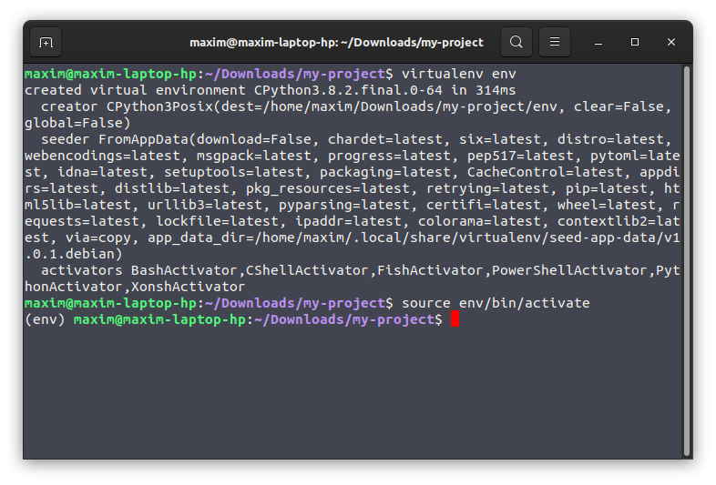

# VirtualEnv

## What is VirtualEnv?
VirtualEnv provide you separate python environement where you can install independently all your dependencies without having conflicts.

## Why should I use it?
Let's say that you want to use Flask, but for a first project you have to use an old version of it and a more recent the second one. You can't install both versions on the same enviroment. You will have conflicts and only the last installation will be kept. 
With VirtalEnv, you can create two (or more) python enviroments and install a different version of it.

## Installation
To install it, you can simply use pip in the terminal.

```bash
pip install virtualenv
```

You can also install it using you OS package manager. For example on Ubuntu/Debian you can use:

```bash
sudo apt-get install virtualenv
```

## Usage

When it will be installed, you can create a new enviroment and then activate it so you can use it.

* To create a new one, type in you terminal:
```bash
virtualenv env
```
It will create it **in your current directory** and will be nammed `env` it's a convention but you can of course change the name if you'd like. 
Just think to use a transparent name so anyone can guess what it is.

It's possible that your terminal doesn't recognize virtualenv. In this case, you can use python (as it's a python's package) as follow:

```bash
python -m virtalenv env
```

* To activate it:
```bash
source env/bin/activate
```

If you changed the name `env` you have to change it in this command too.

If you successfully activated the environemennt you should see it between parenthesis in your terminal. See screenshot below.



Now you should be all good! Congratulaion, you can now install any dependencies without caring of the conflicts. 

To install a depencies use `pip` even if you normally use `pip3`. Virtualenv rebind *(create an alias)* `pip` to suit your environement.

## Check the dependencies installed in your enviroment
To check which dependencies are installed, you can type:
```bash
pip freeze
```

And if you want to write thoses in a text file. (So you can easly install them back in a new enviroment afterward)
You can use this command that will create a `requirements.txt` file and save the list of all you dependencies and versions of it in it.
```bash
pip freeze > requirements.txt
```

If you have to re-install them, you just have to do:
```bash
pip install -r requirements.txt
```

## Well done!
You can now install an infinity of python environement with differents version of you packages!
Nothing can stop you now! *Except typos. Typos are gonna always stop you...*

